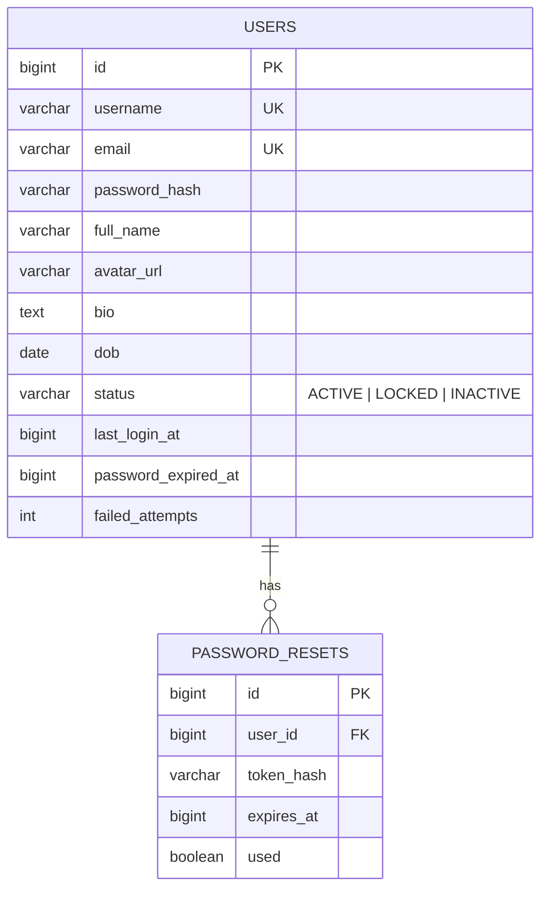
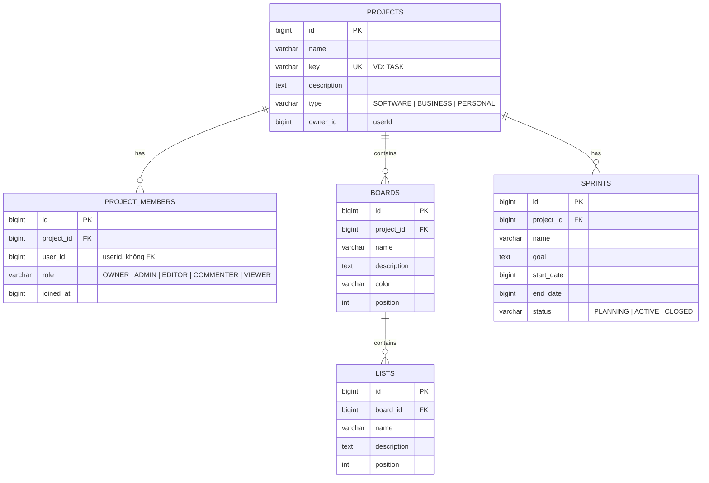
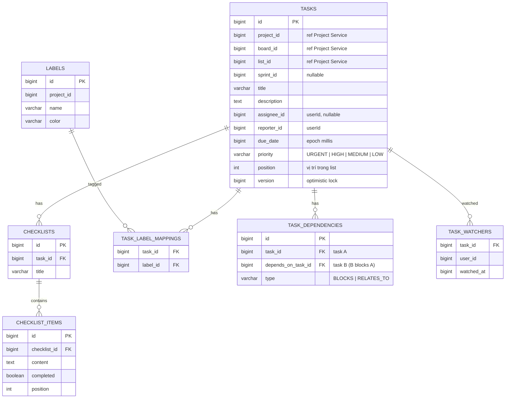
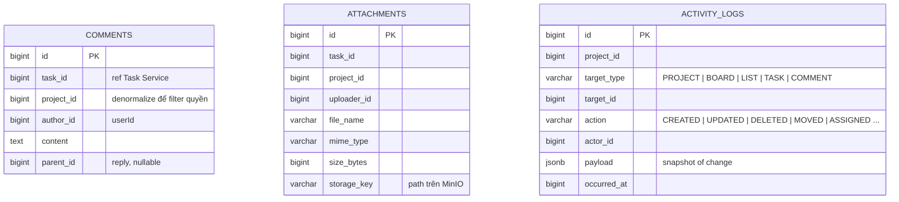
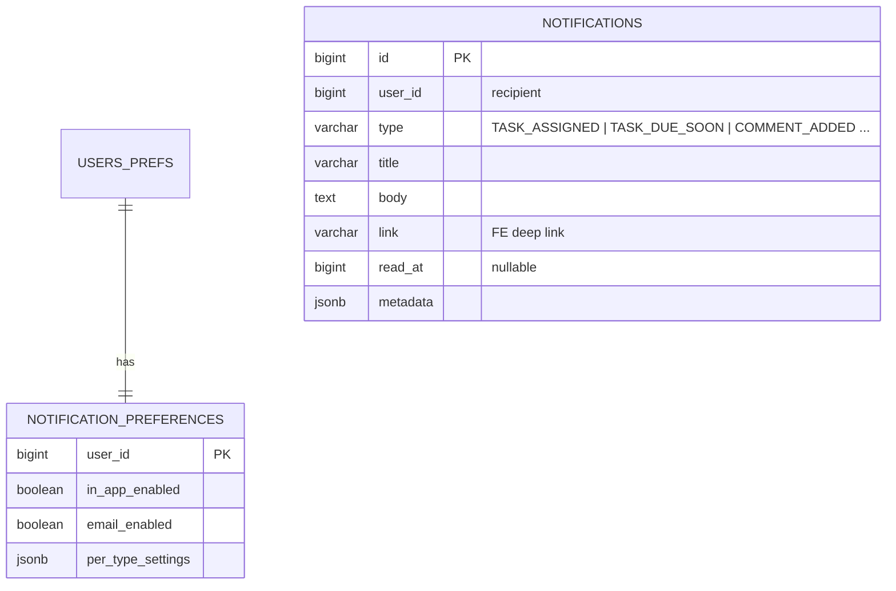
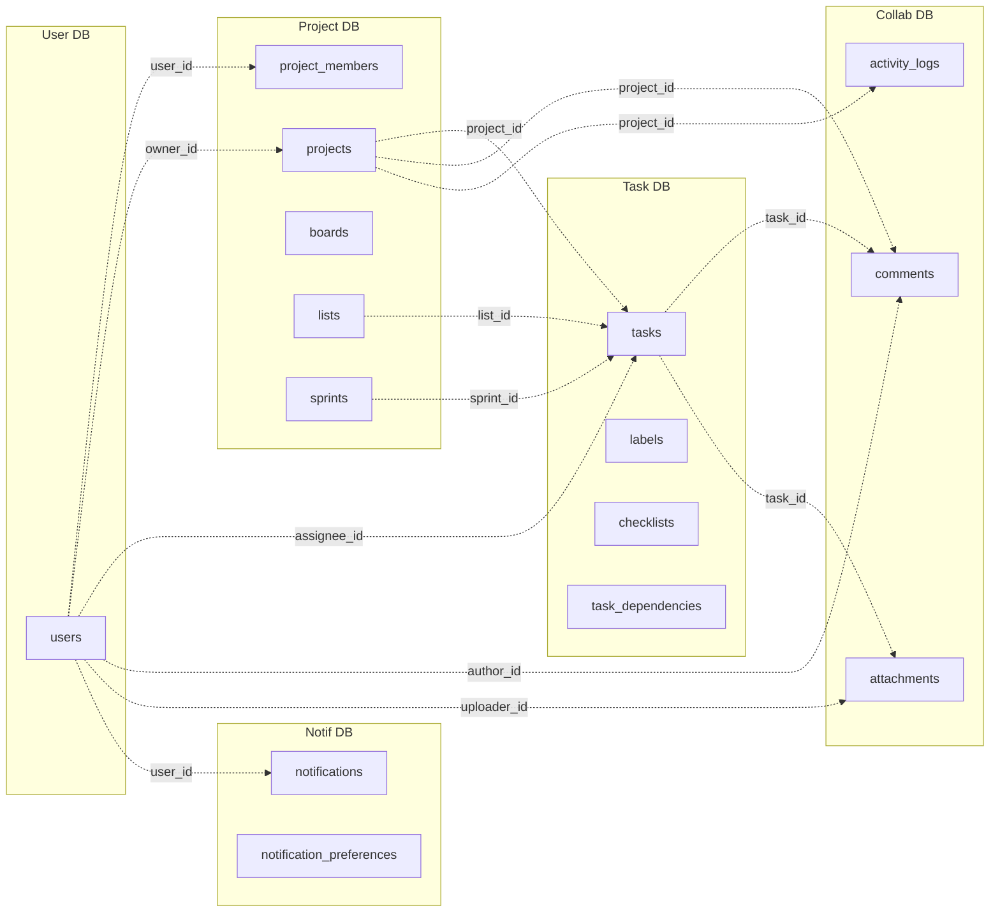

# ERD — TaskFlow Microservices

Mỗi service có **database PostgreSQL riêng** (database-per-service). Không có FK xuyên service. Tham chiếu cross-service chỉ lưu ID (`user_id`, `project_id` …) ở dạng `BIGINT`, validate qua REST call hoặc event.

Tất cả entity kế thừa `AuditEntity` ⇒ mọi bảng có thêm cột:

| Cột | Kiểu | Ghi chú |
|---|---|---|
| `id` | `BIGSERIAL` PK | |
| `created_by` | `varchar(255)` | username |
| `created_at` | `bigint` | epoch millis |
| `last_updated_by` | `varchar(255)` | |
| `last_updated_at` | `bigint` | |
| `deleted` | `boolean` | default `false` |

Các bảng dưới đây **KHÔNG liệt kê lại** 6 cột audit để tiết kiệm chỗ — chỉ ghi cột nghiệp vụ.

---

## 1. User Service DB (`taskflow_user`)

**Bảng `users`**

| Cột | Kiểu | Ràng buộc |
|---|---|---|
| `username` | `varchar(64)` | UNIQUE, NOT NULL |
| `email` | `varchar(255)` | UNIQUE, NOT NULL |
| `password_hash` | `varchar(255)` | BCrypt, NOT NULL |
| `full_name` | `varchar(255)` | |
| `avatar_url` | `varchar(512)` | URL trên MinIO |
| `bio` | `text` | |
| `dob` | `date` | |
| `status` | `varchar(20)` | enum: ACTIVE / LOCKED / INACTIVE |
| `last_login_at` | `bigint` | epoch millis |
| `password_expired_at` | `bigint` | nullable |
| `failed_attempts` | `int` | default 0, lock khi >=5 |

Index: `idx_users_email`, `idx_users_username`.

**Bảng `password_resets`** (token một lần)

| Cột | Kiểu | Ghi chú |
|---|---|---|
| `user_id` | `bigint` | FK nội bộ |
| `token_hash` | `varchar(255)` | SHA-256 của token |
| `expires_at` | `bigint` | |
| `used` | `boolean` | default false |

---

## 2. Project Service DB (`taskflow_project`)

**Bảng `projects`**

| Cột | Kiểu | Ràng buộc |
|---|---|---|
| `name` | `varchar(255)` | NOT NULL |
| `key` | `varchar(10)` | UNIQUE, viết hoa, vd `TF`, `MOB` |
| `description` | `text` | |
| `type` | `varchar(20)` | enum |
| `owner_id` | `bigint` | userId, NOT NULL |

Index: `idx_projects_key`, `idx_projects_owner`.

**Bảng `project_members`**

| Cột | Kiểu | Ràng buộc |
|---|---|---|
| `project_id` | `bigint` | FK |
| `user_id` | `bigint` | userId, NOT NULL |
| `role` | `varchar(20)` | enum 5 role |
| `joined_at` | `bigint` | |

UNIQUE `(project_id, user_id)`. Index: `idx_member_user` để query nhanh "project nào của user X".

**Bảng `boards`**

| Cột | Kiểu | Ghi chú |
|---|---|---|
| `project_id` | `bigint` | FK |
| `name` | `varchar(255)` | NOT NULL |
| `description` | `text` | |
| `color` | `varchar(7)` | hex color |
| `position` | `int` | sort order trong project |

**Bảng `lists`** (cột Kanban)

| Cột | Kiểu | Ghi chú |
|---|---|---|
| `board_id` | `bigint` | FK |
| `name` | `varchar(255)` | vd "To Do", "Doing", "Done" |
| `description` | `text` | |
| `position` | `int` | thứ tự cột |

**Bảng `sprints`**

| Cột | Kiểu | Ghi chú |
|---|---|---|
| `project_id` | `bigint` | FK |
| `name` | `varchar(255)` | |
| `goal` | `text` | |
| `start_date` | `bigint` | epoch millis |
| `end_date` | `bigint` | |
| `status` | `varchar(20)` | PLANNING/ACTIVE/CLOSED |

---

## 3. Task Service DB (`taskflow_task`)

**Bảng `tasks`**

| Cột | Kiểu | Ghi chú |
|---|---|---|
| `project_id` | `bigint` | ref Project Service, NOT NULL |
| `board_id` | `bigint` | denormalize để filter nhanh |
| `list_id` | `bigint` | trạng thái = list hiện tại |
| `sprint_id` | `bigint` | nullable |
| `title` | `varchar(500)` | NOT NULL |
| `description` | `text` | markdown |
| `assignee_id` | `bigint` | userId, nullable |
| `reporter_id` | `bigint` | userId tạo task |
| `due_date` | `bigint` | epoch millis, nullable |
| `priority` | `varchar(10)` | URGENT/HIGH/MEDIUM/LOW |
| `position` | `int` | sort order trong list |
| `version` | `bigint` | `@Version` cho optimistic lock |

Index: `idx_tasks_list`, `idx_tasks_assignee`, `idx_tasks_project`, `idx_tasks_due_date`.

> **Lưu ý**: `board_id` lưu ở Task để filter task theo board nhanh — denormalize có chủ đích, đồng bộ qua event khi list bị move giữa board.

**Bảng `labels`** (label thuộc project, tái sử dụng cho nhiều task — đặt trong Task Service để tránh cross-service mỗi lần đọc task)

| Cột | Kiểu | Ghi chú |
|---|---|---|
| `project_id` | `bigint` | NOT NULL |
| `name` | `varchar(50)` | |
| `color` | `varchar(7)` | hex |

UNIQUE `(project_id, name)`.

**Bảng `task_label_mappings`** (n-n)

PK kép `(task_id, label_id)`.

**Bảng `checklists`** + **`checklist_items`**

Cấu trúc cha-con. Item có cột `completed BOOLEAN`, `position INT`.

**Bảng `task_dependencies`**

| Cột | Kiểu | Ghi chú |
|---|---|---|
| `task_id` | `bigint` | task A |
| `depends_on_task_id` | `bigint` | task B (B phải xong trước A) |
| `type` | `varchar(20)` | BLOCKS / RELATES_TO |

UNIQUE `(task_id, depends_on_task_id)`. Validate cycle khi insert (DFS).

**Bảng `task_watchers`**

PK kép `(task_id, user_id)` + `watched_at`.

---

## 4. Collaboration Service DB (`taskflow_collab`)

**Bảng `comments`**

| Cột | Kiểu | Ghi chú |
|---|---|---|
| `task_id` | `bigint` | NOT NULL |
| `project_id` | `bigint` | denormalize, dùng filter quyền |
| `author_id` | `bigint` | userId |
| `content` | `text` | markdown |
| `parent_id` | `bigint` | nullable, reply 1 cấp |

Index: `idx_comments_task`.

**Bảng `attachments`**

| Cột | Kiểu | Ghi chú |
|---|---|---|
| `task_id` | `bigint` | |
| `project_id` | `bigint` | denormalize |
| `uploader_id` | `bigint` | |
| `file_name` | `varchar(255)` | tên gốc |
| `mime_type` | `varchar(100)` | |
| `size_bytes` | `bigint` | max 25MB |
| `storage_key` | `varchar(500)` | path MinIO, vd `tasks/42/uuid.png` |

**Bảng `activity_logs`** (append-only, không soft delete)

| Cột | Kiểu | Ghi chú |
|---|---|---|
| `project_id` | `bigint` | filter nhanh |
| `target_type` | `varchar(20)` | enum |
| `target_id` | `bigint` | |
| `action` | `varchar(50)` | enum |
| `actor_id` | `bigint` | userId |
| `payload` | `jsonb` | snapshot diff |
| `occurred_at` | `bigint` | epoch millis |

Index: `idx_activity_project_time` `(project_id, occurred_at DESC)`, `idx_activity_target` `(target_type, target_id)`.

---

## 5. Notification Service DB (`taskflow_notif`)

**Bảng `notifications`**

| Cột | Kiểu | Ghi chú |
|---|---|---|
| `user_id` | `bigint` | recipient |
| `type` | `varchar(50)` | enum |
| `title` | `varchar(255)` | |
| `body` | `text` | |
| `link` | `varchar(500)` | vd `/projects/42/boards/3/tasks/100` |
| `read_at` | `bigint` | nullable |
| `metadata` | `jsonb` | extra context (taskId, projectId…) |

Index: `idx_notif_user_unread` `(user_id, read_at)`.

**Bảng `notification_preferences`** (PK = user_id, không dùng id riêng)

| Cột | Kiểu | Ghi chú |
|---|---|---|
| `user_id` | `bigint` PK | |
| `in_app_enabled` | `boolean` | default true |
| `email_enabled` | `boolean` | default true |
| `per_type_settings` | `jsonb` | granular per event type |

---

## 6. Sơ đồ tổng — Quan hệ logic xuyên service

> Đường nét đứt = tham chiếu **logic** (không có FK vật lý xuyên service). Tính toàn vẹn được đảm bảo bằng:
> 1. Validate khi tạo (REST call Project Service / User Service).
> 2. Cleanup qua event khi xóa (vd `TaskDeleted` ⇒ Collaboration xóa comment/attachment).
