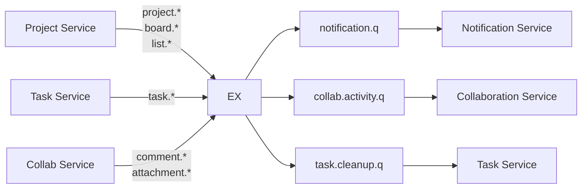

# Event Schema — TaskFlow (RabbitMQ)

## 1. Topology RabbitMQ

| Thành phần | Tên | Loại |
|---|---|---|
| Exchange chính | `taskflow.events` | `topic` |
| DLX (dead-letter) | `taskflow.events.dlx` | `topic` |
| Routing key pattern | `<domain>.<event_name>` | vd `task.created`, `project.member.added` |

Mỗi consumer service có **queue riêng** binding với routing key cần dùng:

| Queue | Service | Bindings (routing key) |
|---|---|---|
| `notification.q` | Notification | `task.*`, `project.member.*`, `comment.*` |
| `collab.activity.q` | Collaboration | `task.*`, `project.*`, `board.*`, `list.*`, `comment.*`, `attachment.*` |
| `task.cleanup.q` | Task | `project.deleted`, `list.deleted`, `board.deleted` |

Mỗi queue có **DLQ tương ứng** (`<queue>.dlq`) bind với DLX. Sau 3 lần retry thất bại → message chuyển sang DLQ để team kiểm tra.

## 2. Common Envelope

Mọi event đều bọc bằng envelope chung:

```json
{
  "event_id": "0e1a4b08-3e54-4e4a-9f55-9c0a3a7d3c4d",
  "event_type": "task.created",
  "schema_version": 1,
  "occurred_at": 1746345600000,
  "actor_id": 42,
  "trace_id": "8f3c2b6a4d1e5f7a",
  "data": { ... }
}
```

| Trường | Kiểu | Bắt buộc | Mô tả |
|---|---|---|---|
| `event_id` | UUID v4 | có | Unique mỗi event, dùng để dedup ở consumer |
| `event_type` | string | có | Trùng routing key |
| `schema_version` | int | có | Bắt đầu = 1, tăng khi thay đổi breaking |
| `occurred_at` | long (epoch ms) | có | Thời điểm sự kiện xảy ra |
| `actor_id` | long (userId) | có (trừ system event) | Ai gây ra |
| `trace_id` | string | có | Chuyển từ MDC để trace xuyên service |
| `data` | object | có | Payload theo từng event_type bên dưới |

**Idempotent consumer**: mỗi consumer lưu `event_id` đã xử lý vào Redis với TTL 24h. Nếu trùng → skip.

## 3. Convention chung

- Trường `id` của object trong `data` là kiểu `long`.
- Thời gian: `long` epoch millis, không dùng ISO string.
- `null` được dùng thay cho "không có giá trị".
- Khi update, payload **chứa cả before và after** chỉ khi consumer cần (Activity Log) — các event khác chỉ chứa state mới.
- **Backward-compatible**: thêm field mới = OK; đổi tên hoặc xoá = bump `schema_version`.

---

## 4. Catalog các Event

> **User Service không publish event** trong scope đồ án này. Welcome mail không cần thiết; thông tin user (email, full_name) được service khác lookup qua REST `/internal/users/{id}/contact` (cache TTL ngắn). Có thể bổ sung `user.registered` / `user.updated` về sau nếu cần.

### 4.1 Project Service publish

#### `project.created`
**Producer**: Project. **Consumer**: Collaboration, Notification.

```json
{
  "data": {
    "project_id": 7,
    "key": "TFM",
    "name": "TaskFlow Mobile",
    "owner_id": 42,
    "type": "SOFTWARE"
  }
}
```

#### `project.deleted`
**Producer**: Project. **Consumer**: Task (cleanup task), Collaboration (cleanup comment/attachment), Notification (xoá thông báo).

```json
{
  "data": { "project_id": 7 }
}
```

#### `project.member.added`
**Producer**: Project. **Consumer**: Notification (gửi mail mời + push), Collaboration.

```json
{
  "data": {
    "project_id": 7,
    "user_id": 99,
    "role": "EDITOR",
    "invited_by": 42
  }
}
```

#### `project.member.removed`
```json
{
  "data": {
    "project_id": 7,
    "user_id": 99,
    "removed_by": 42
  }
}
```

#### `project.member.role_changed`
```json
{
  "data": {
    "project_id": 7,
    "user_id": 99,
    "old_role": "EDITOR",
    "new_role": "ADMIN",
    "changed_by": 42
  }
}
```

#### `board.created` / `board.deleted` / `list.created` / `list.deleted`

```json
// board.created
{
  "data": {
    "board_id": 11,
    "project_id": 7,
    "name": "Backend",
    "color": "#5BA4CF"
  }
}
```

```json
// list.deleted
{
  "data": {
    "list_id": 22,
    "board_id": 11,
    "project_id": 7
  }
}
```

> Khi `list.deleted`, Task Service consume để xử lý task trong list (move sang `Backlog` hoặc soft delete tuỳ option).

---

### 4.2 Task Service publish

#### `task.created`
**Consumer**: Notification (báo assignee + watchers của board), Collaboration (Activity Log).

```json
{
  "data": {
    "task_id": 100,
    "project_id": 7,
    "board_id": 11,
    "list_id": 22,
    "title": "Implement login flow",
    "assignee_id": 42,
    "reporter_id": 42,
    "due_date": 1764892800000,
    "priority": "HIGH"
  }
}
```

#### `task.updated`
**Consumer**: Notification (báo watchers nếu field nhạy cảm thay đổi: due_date, priority, title), Collaboration.

```json
{
  "data": {
    "task_id": 100,
    "project_id": 7,
    "changes": {
      "title":     { "from": "Implement login", "to": "Implement login flow" },
      "due_date":  { "from": 1764806400000,     "to": 1764892800000 }
    }
  }
}
```

> `changes` là **diff field-level** — Activity Log dùng trực tiếp, Notification chỉ ping nếu trong allow-list field.

#### `task.moved`
```json
{
  "data": {
    "task_id": 100,
    "project_id": 7,
    "from_list_id": 22,
    "to_list_id": 23,
    "new_position": 0
  }
}
```

#### `task.assigned`
```json
{
  "data": {
    "task_id": 100,
    "project_id": 7,
    "old_assignee_id": null,
    "new_assignee_id": 42
  }
}
```

#### `task.deleted`
**Consumer**: Collaboration (cleanup comment + attachment).

```json
{
  "data": { "task_id": 100, "project_id": 7 }
}
```

#### `task.due_soon` / `task.overdue` (system event)
**Producer**: Task Service Scheduler (chạy cron mỗi 15 phút). **Actor_id** = `null` (system).

```json
{
  "event_type": "task.due_soon",
  "actor_id": null,
  "data": {
    "task_id": 100,
    "project_id": 7,
    "assignee_id": 42,
    "due_date": 1764892800000,
    "hours_remaining": 24
  }
}
```

#### `task.dependency.changed`
```json
{
  "data": {
    "task_id": 100,
    "project_id": 7,
    "added": [{ "depends_on_task_id": 105, "type": "BLOCKS" }],
    "removed": [{ "depends_on_task_id": 99 }]
  }
}
```

---

### 4.3 Collaboration Service publish

#### `comment.added`
**Consumer**: Notification (báo assignee + watchers + người được @mention).

```json
{
  "data": {
    "comment_id": 555,
    "task_id": 100,
    "project_id": 7,
    "author_id": 42,
    "content_preview": "Đã merge PR, ai review giúp?",
    "mentioned_user_ids": [99, 101]
  }
}
```

#### `attachment.uploaded`
```json
{
  "data": {
    "attachment_id": 88,
    "task_id": 100,
    "project_id": 7,
    "uploader_id": 42,
    "file_name": "design.png",
    "size_bytes": 524288,
    "mime_type": "image/png"
  }
}
```

---

## 5. Sơ đồ Producer × Consumer



## 6. Reliability — quy tắc xử lý

1. **Publisher confirm** bật ở mọi service publish (Spring AMQP `publisher-confirm-type: correlated`).
2. **Outbox pattern** (khuyến nghị, optional): service ghi event vào bảng `outbox` cùng transaction nghiệp vụ; 1 worker đọc và publish — đảm bảo at-least-once.
3. **At-least-once delivery**: consumer phải **idempotent** (dedup theo `event_id` qua Redis).
4. **Retry**: `defaultRequeueRejected: false` + Spring Retry 3 lần với backoff 1s/5s/15s; thất bại → DLQ.
5. **Versioning**: thêm field mới = compatible. Đổi tên / xoá field = bump `schema_version`, consumer phải hỗ trợ song song 2 version trong giai đoạn migration.

## 7. Naming Convention

- Routing key: lowercase, dấu `.` phân tách. Format `<domain>.<entity>.<verb>`. Ví dụ `project.member.added`, `task.dependency.changed`.
- DTO Java: `<EventName>Event` (vd `TaskCreatedEvent`), nằm trong package `com.taskflow.<service>.dto.event`.
- Class envelope chung tên `EventEnvelope<T>` đặt trong **shared library** (jar nội bộ) để tránh duplicate.

## 8. Shared Library

Tạo 1 module Maven `taskflow-events-contract` xuất bản file JAR chứa:
- `EventEnvelope<T>`
- Tất cả `*Event` DTO
- Constants: routing key, queue name, exchange name

Các service đều `<dependency>` vào module này. Khi event thay đổi, bump version JAR — consumer rebuild với version mới.
