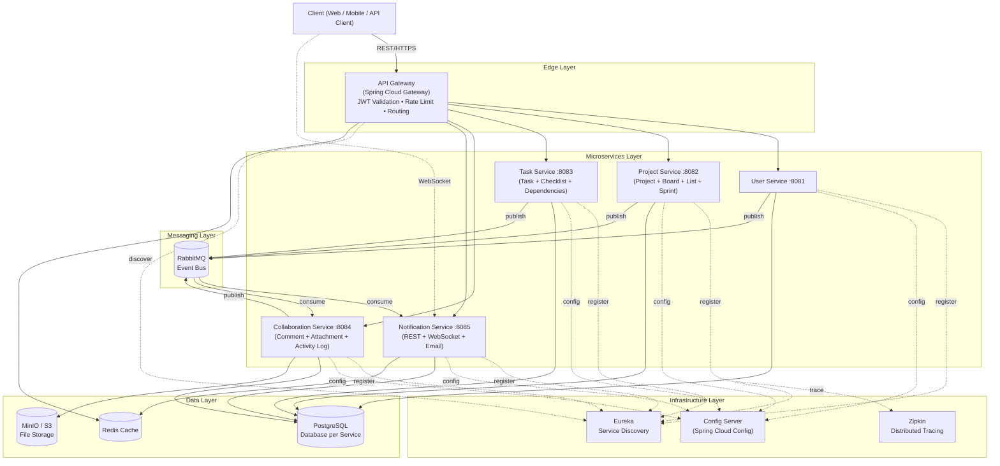

**TÀI LIỆU ĐẶC TẢ KIẾN TRÚC HỆ THỐNG**

**Tên đồ án:** TaskFlow \- Hệ thống Quản lý Nhiệm vụ và Dự án  
**Kiến trúc:** Microservices Architecture  
**Công nghệ chính:** Java Spring Boot  
**Ngày lập:** 28/04/2026

**Nhóm thực hiện:** \[Tên nhóm của bạn\]

### **1\. Giới thiệu**

#### **1.1. Mô tả tổng quát**

TaskFlow là hệ thống quản lý nhiệm vụ và dự án theo phong cách kết hợp giữa Trello và Jira. Hệ thống hỗ trợ cá nhân và nhóm tạo dự án, board Kanban, quản lý task, giao việc, theo dõi tiến độ và nhận thông báo thời gian thực.

Hệ thống được thiết kế theo kiến trúc **Microservices**, đảm bảo tính độc lập, khả năng mở rộng và dễ bảo trì.

#### **1.2. Mục tiêu**

* Xây dựng hệ thống với ít nhất 5 microservices độc lập.  
* Sử dụng RESTful API cho giao tiếp đồng bộ.  
* Sử dụng Message Queue (RabbitMQ) cho giao tiếp bất đồng bộ.  
* Áp dụng Service Discovery (Eureka), API Gateway và Centralized Config.  
* Hỗ trợ thông báo thời gian thực qua WebSocket.  
* Đảm bảo tính mở rộng, chịu lỗi (Circuit Breaker) và loose coupling giữa các service.

### **2\. Kiến trúc Tổng quan**

Hệ thống được tổ chức theo các lớp sau:

* **Client Layer**: Web Application, Mobile App, API Client  
* **Edge Layer**: API Gateway (Spring Cloud Gateway) — định tuyến, xác thực JWT, rate limit  
* **Infrastructure Layer**: Eureka (Service Discovery), Spring Cloud Config (Centralized Config), Zipkin (Distributed Tracing)  
* **Microservices Layer**: 5 dịch vụ chính  
* **Messaging Layer**: RabbitMQ (Event-Driven)  
* **Data Layer**: PostgreSQL (Database per Service), Redis (cache), MinIO/S3 (file storage)

### **3\. Biểu đồ Kiến trúc Hệ thống**

### **4\. Các Microservices và Trách nhiệm**

| STT | Microservice | Port | Trách nhiệm chính | Công nghệ chính |
| ----- | ----- | ----- | ----- | ----- |
| 1 | **User Service** | 8081 | Quản lý người dùng, xác thực, cấp JWT, Profile | Spring Boot, Spring Security, JWT |
| 2 | **Project Service** | 8082 | Quản lý Project, Board, List (cột Kanban), Membership/Role, Sprint, Backlog | Spring Boot, Spring Data JPA |
| 3 | **Task Service** | 8083 | Quản lý Task, Checklist, Task Dependencies, di chuyển task | Spring Boot, Spring Data JPA |
| 4 | **Collaboration Service** | 8084 | Comment, Attachment (MinIO/S3), Activity Log toàn hệ thống | Spring Boot, Spring AMQP |
| 5 | **Notification Service** | 8085 | Thông báo realtime (WebSocket), Email, lưu lịch sử thông báo | Spring Boot, Spring AMQP, Spring WebSocket, JavaMail |

> **Ghi chú phân chia:**  
> – Board và List được gộp vào Project Service vì Board luôn thuộc Project và domain rất gần nhau (tránh chia service quá nhỏ gây overhead vận hành).  
> – Comment / Attachment / Activity Log được tách thành **Collaboration Service** để Task Service không bị quá tải trách nhiệm và để Activity Log có thể tổng hợp event từ tất cả service khác.

### **5\. Cơ chế Giao tiếp giữa các Service**

#### **5.1. Giao tiếp Đồng bộ (Synchronous)**

* Sử dụng **RESTful API** qua **API Gateway**.  
* **JWT Validation tập trung tại API Gateway**: Gateway xác thực JWT, sau đó forward `X-User-Id` và `X-User-Roles` qua header tới downstream service. Các service nội bộ tin tưởng các header này (mạng nội bộ).  
* Các service gọi lẫn nhau bằng **WebClient** (khuyến nghị) thông qua tên service đăng ký trên **Eureka**.  
* **Resilience4j** cấu hình Circuit Breaker + Retry + Timeout cho mọi cross-service call.

##### **5.1.1. Các luồng gọi REST giữa service**

Mọi cross-service call dùng **WebClient** qua tên service đăng ký trên Eureka (vd: `http://task-service/api/...`), **forward lại header `X-User-Id` và `X-User-Roles`** đã được Gateway verify trước đó để service đích kiểm tra quyền — không cần truyền JWT giữa các service nội bộ.

| Service gọi | Service được gọi | Khi nào | Mục đích |
| ----- | ----- | ----- | ----- |
| Task Service | Project Service | Tạo / cập nhật Task | Verify `projectId` tồn tại + user là member + có role ≥ Editor |
| Task Service | User Service | Gán Assignee | Verify `assigneeId` tồn tại và là member của project |
| Collaboration Service | Task Service | Thêm Comment / Attachment | Verify `taskId` tồn tại + user có quyền truy cập task |
| Collaboration Service | Project Service | Hiển thị Activity Log | Lấy tên project / board để hiển thị (có thể cache) |
| Notification Service | User Service | Gửi email | Lấy email + tên hiển thị + ngôn ngữ ưa thích của user |
| Project Service | User Service | Mời thành viên | Verify user tồn tại theo email/username |

**Quy tắc khi gọi:**

* Bọc bởi **Resilience4j Circuit Breaker** — nếu service đích down, fallback trả lỗi rõ ràng (HTTP 503 + thông điệp) thay vì để client treo.  
* Cấu hình **timeout** ngắn (vd 2 giây) cho mỗi call, tránh cascade slowdown.  
* Cấu hình **retry** (1–2 lần) chỉ cho lỗi mạng tạm thời, không retry cho lỗi 4xx.  
* Với truy vấn lặp lại (vd Notification Service hay cần email user) → cache kết quả ở **Redis** với TTL hợp lý.

**Bảo mật mạng nội bộ:**

* Trong môi trường Docker Compose, các service **không expose port** ra host — chỉ API Gateway map port ra ngoài.  
* Service-to-service call chỉ đi qua Docker network nội bộ, tránh nguy cơ giả mạo header `X-User-Id` từ client.

#### **5.2. Giao tiếp Bất đồng bộ (Asynchronous)**

Sử dụng **RabbitMQ** với mô hình **Event-Driven**, exchange kiểu **topic**.

**Event được publish:**

* **Task Service**: `TaskCreated`, `TaskUpdated`, `TaskMoved`, `TaskAssigned`, `TaskDueSoon`, `TaskOverdue`, `TaskDeleted`  
* **Project Service**: `ProjectCreated`, `BoardCreated`, `MemberAdded`, `MemberRemoved`, `RoleChanged`  
* **Collaboration Service**: `CommentAdded`, `AttachmentUploaded`  
* **User Service**: `UserRegistered`, `UserUpdated`

**Event được consume:**

* **Notification Service**: nhận hầu hết event để gửi thông báo realtime + email.  
* **Collaboration Service**: nhận event để ghi Activity Log thống nhất toàn hệ thống.

#### **5.3. Giao tiếp Realtime với Client**

* **Notification Service** mở endpoint **WebSocket / STOMP** (`/ws/notifications`).  
* Client kết nối sau khi login (JWT trong handshake), server push thông báo theo `userId`.  
* Cùng cơ chế dùng để **đồng bộ board realtime**: khi 1 user kéo task, các user khác đang xem cùng board được cập nhật qua WebSocket topic `/topic/board/{boardId}`.

#### **5.4. Chiến lược chia sẻ dữ liệu (Database per Service)**

Vì mỗi service có DB riêng, dữ liệu liên quan được xử lý theo 2 cách:

* **API Composition tại Gateway/BFF**: ví dụ khi hiển thị task, BFF gọi Task Service + User Service + Project Service rồi ghép kết quả.  
* **Eventual Consistency qua event**: Collaboration Service lắng nghe event để đồng bộ thông tin user/project nhằm tránh phải gọi REST mỗi lần khi ghi Activity Log.

#### **5.5. Saga Pattern cho luồng phân tán**

Áp dụng **Choreography Saga** cho luồng "Tạo project mới":

1. Project Service tạo project → publish `ProjectCreated`.  
2. Project Service consume chính event đó để tạo board mặc định + thêm owner làm member.  
3. Notification Service gửi mail welcome.  
4. Collaboration Service ghi Activity Log "Project created".

Nếu một bước thất bại, service liên quan publish event compensation (`ProjectCreationFailed`) để các service trước rollback.

### **6\. Công nghệ Stack**

* **Backend**: Java 17 \+ Spring Boot 3.3+  
* **API Gateway**: Spring Cloud Gateway  
* **Service Discovery**: Spring Cloud Netflix Eureka  
* **Centralized Config**: Spring Cloud Config Server  
* **Message Queue**: RabbitMQ  
* **Database**: PostgreSQL (mỗi service một database)  
* **Cache**: Redis (rate limit ở Gateway, dashboard, idempotency key)  
* **File Storage**: MinIO (S3-compatible)  
* **Authentication**: JWT (Stateless), validate tập trung tại Gateway  
* **Realtime**: WebSocket / STOMP (Spring WebSocket)  
* **Resilience**: Resilience4j (Circuit Breaker, Retry, Timeout, Bulkhead)  
* **Distributed Tracing**: Micrometer \+ Zipkin  
* **Containerization**: Docker & Docker Compose (kèm healthcheck cho từng service)

### **7\. Đặc tả Chức năng Chi tiết**

#### **7.1. Module User & Authentication**

* Đăng ký tài khoản mới bằng email và mật khẩu  
* Đăng nhập hệ thống và nhận JWT Token  
* Quên mật khẩu và đặt lại mật khẩu (qua email)  
* Xem và cập nhật thông tin Profile cá nhân (tên hiển thị, avatar, bio, ngày sinh…)  
* Đổi mật khẩu  
* Đăng xuất khỏi hệ thống

#### **7.2. Module Project (Dự án)**

* Tạo mới dự án (tên dự án, mô tả, key, loại dự án)  
* Xem danh sách tất cả dự án mà người dùng đang tham gia  
* Xem thông tin chi tiết một dự án  
* Cập nhật thông tin dự án  
* Xóa dự án (chỉ **Owner** thực hiện)  
* **Tìm kiếm dự án** theo tên/key (Postgres `ILIKE`)  
* Quản lý thành viên dự án:  
  * Thêm thành viên vào dự án  
  * Xóa thành viên khỏi dự án  
  * Thay đổi quyền hạn thành viên (xem mục **7.6 — Phân quyền**)

**Chức năng nâng cao:**

* Quản lý **Sprint** (tạo sprint, cập nhật thời gian, đóng sprint). Sprint lưu metadata ở Project Service; Task Service lưu `sprint_id` trên mỗi task.  
* Quản lý **Backlog** của dự án  
* Tạo và xem **Báo cáo tiến độ dự án** (số lượng task theo trạng thái, theo thành viên, theo độ ưu tiên, burn-down chart cơ bản)

#### **7.3. Module Board (thuộc Project Service)**

* Tạo Board mới trong một dự án  
* Xem danh sách các Board thuộc dự án  
* Cập nhật thông tin Board (tên, mô tả, màu nền…)  
* Xóa Board  
* **Tìm kiếm Board** theo tên trong phạm vi 1 dự án  
* Quản lý List (Cột Kanban):  
  * Tạo mới List  
  * Sửa tên và mô tả List  
  * Xóa List  
  * Sắp xếp thứ tự các List bằng kéo thả (Drag & Drop)
* **Realtime sync**: khi 1 user di chuyển task hoặc sửa list, các user khác đang xem board được cập nhật ngay qua WebSocket.

#### **7.4. Module Task (Nhiệm vụ) – Core Module**

**7.4.1. Chức năng cơ bản**

* Tạo mới Task (hỗ trợ **idempotency key** tránh double submit)  
* Xem chi tiết một Task  
* Cập nhật thông tin Task  
* Xóa Task (**soft delete**, có thể khôi phục từ Recycle Bin)

**7.4.2. Thuộc tính của Task**

* Tiêu đề Task (bắt buộc)  
* Mô tả chi tiết  
* Gán người thực hiện (**Assignee**)  
* Ngày hết hạn (**Due Date**)  
* Độ ưu tiên (**Priority**: High, Medium, Low, Urgent)  
* Nhãn màu (**Labels**)  
* Trạng thái (được xác định bởi List hiện tại)  
* Sprint (nếu thuộc một Sprint)

**7.4.3. Tính năng bổ trợ**

* Quản lý **Checklist** (thêm/sửa/xóa mục công việc nhỏ, đánh dấu hoàn thành) — *Task Service*  
* Thêm **Comment** (bình luận) trên Task — *Collaboration Service*  
* Đính kèm file và ảnh (**Attachment**) — *Collaboration Service, lưu trên MinIO/S3*

**7.4.4. Chức năng nâng cao trong Task**

* **Di chuyển Task** giữa các List khác nhau (Drag & Drop)  
* **Watch / Follow Task**: theo dõi để nhận thông báo khi có thay đổi  
* **Task Dependencies**: thiết lập phụ thuộc giữa các Task (Task A phải hoàn thành trước khi Task B bắt đầu); kiểm tra **cycle detection** khi tạo dependency  
* **Activity Log**: do Collaboration Service tổng hợp từ event của tất cả service, ghi lại toàn bộ lịch sử hoạt động (ai tạo, ai sửa, ai di chuyển, ai comment…)

**7.4.5. Tìm kiếm & Lọc**

* **Tìm kiếm Task** theo từ khóa (tiêu đề, mô tả) trong phạm vi 1 board hoặc 1 dự án — Postgres `ILIKE` / Full-Text Search.  
* Lọc Task theo Assignee, Priority, Due Date, Label, Status.  
* Hỗ trợ kết hợp keyword + filter trên cùng 1 endpoint.

#### **7.5. Module Notification (Thông báo)**

* Gửi thông báo **realtime qua WebSocket** \+ **email** dựa trên các sự kiện hệ thống  
* Lưu trữ lịch sử thông báo trong DB của Notification Service  
* Các loại thông báo bao gồm:  
  * Được giao Task mới (Task Assigned)  
  * Task được di chuyển sang List khác  
  * Có bình luận mới trên Task đang theo dõi  
  * Task sắp đến hạn hoặc đã quá hạn  
  * Task Dependencies có thay đổi  
  * Được mời vào dự án (Member Added)  
* Xem danh sách thông báo cá nhân  
* Đánh dấu thông báo đã đọc / chưa đọc  
* Xóa thông báo

#### **7.6. Phân quyền (Role)**

Hệ thống dùng thống nhất **5 vai trò** trong phạm vi mỗi Project:

| Role | Mô tả |
| ----- | ----- |
| **Owner** | Người tạo project, có toàn quyền (kể cả xóa project, chuyển owner) |
| **Admin** | Quản lý thành viên, board, sprint; không xóa được project |
| **Editor** | Tạo/sửa/xóa task, board, list trong phạm vi project |
| **Commenter** | Chỉ xem và comment, không được sửa task |
| **Viewer** | Chỉ xem |

Phân quyền được kiểm tra **2 cấp**: coarse-grained tại API Gateway (theo header `X-User-Roles`) và fine-grained tại từng service (theo `projectId` của tài nguyên đang truy cập).

#### **7.7. Chức năng Nâng cao Chung (Tích hợp)**

* **Dashboard cá nhân**: Hiển thị "My Tasks", "Tasks Assigned to Me", "Tasks Due Soon", "Overdue Tasks" — kết quả cache bằng Redis để giảm tải.  
* **Recycle Bin**: phục hồi project / task đã xóa trong vòng 30 ngày.  
* **Webhook outgoing** (tuỳ chọn): tích hợp với Discord/Slack — gửi message khi task hoàn thành.
